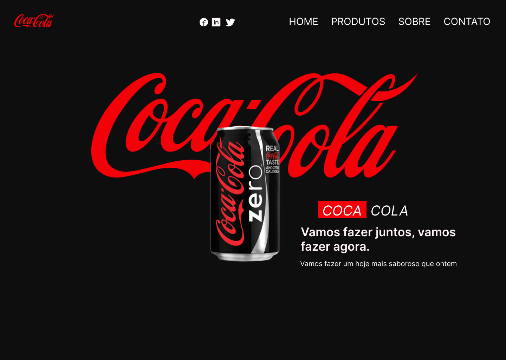
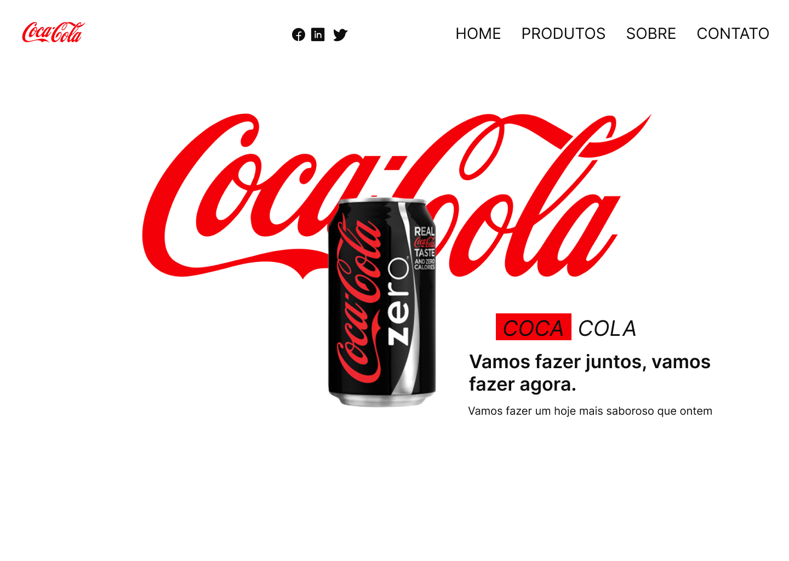
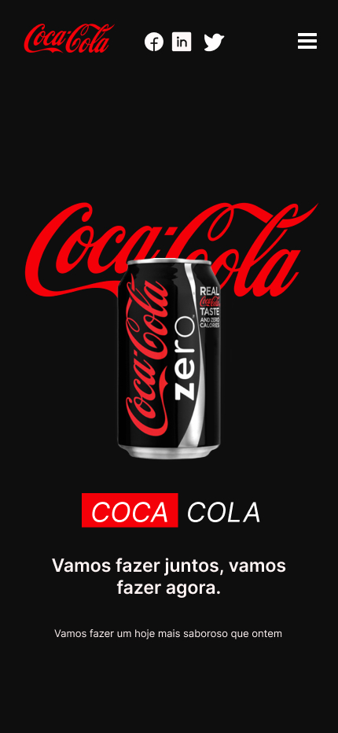
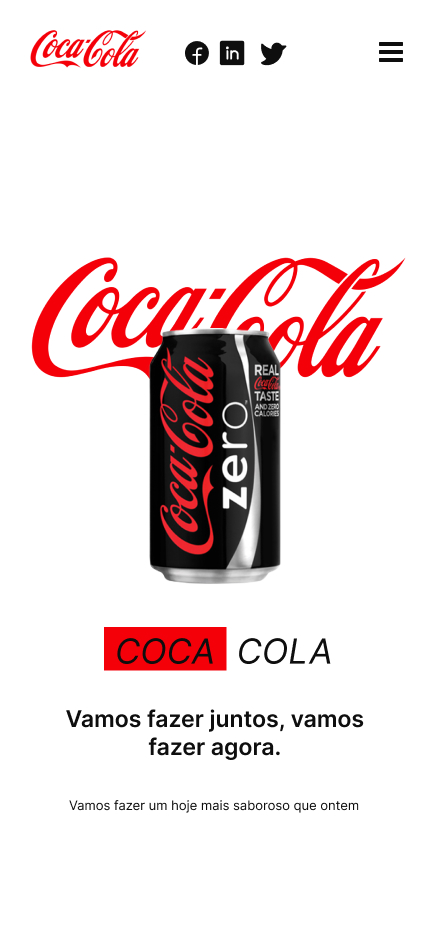

# Landing Page Coca-Cola

# Coca.Cola

Projeto criado utilizando HTML, CSS e JavaScrip.
Foi desenvolvido uma landpage a Coca.cola, com mudandas de temas claro para o escuro.

  <a href="https://landing-page-coca-cola-swart.vercel.app/">Coca.Cola</a>
  
  <a href="https://www.figma.com/file/Kn5bUNs5z8BHErHDKqxyWB/Landing-Page---Coca-Cola?type=design&node-id=0%3A1&t=82IJrpPHXIuY4AmH-1"> Figma Coca.Cola</a>

  
  
  

  

  
  

## Autores

- [@AlbericoJr](https://www.github.com/albericojr)

## Demonstração

https://landing-page-coca-cola-swart.vercel.app/
## Etiquetas

Adicione etiquetas de algum lugar, como: [shields.io](https://shields.io/)

## Licença

[MIT](https://choosealicense.com/licenses/mit/)

